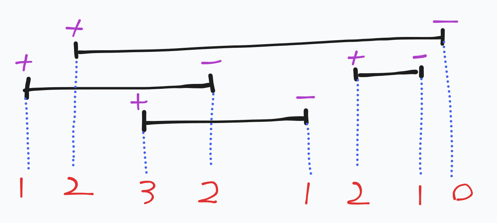

# 題解 CSES - Restaurant Customers
https://cses.fi/problemset/result/6019372/
## 題意
給你 n 位客人的進入和離開餐廳的時間
輸出最多同時有幾位客人同時在餐廳
- n < 2 * 10 ^ 5

## 想法
把每個人加入時間和離開的時間分別看成兩個時間點
並把所有時間點加入陣列後一起排序
然後用一個變數來維護目前餐廳人數
每次遇到加入就增加
反之遇到離開就減少
維護中遇到的最大值就是答案了


## 實作
```cpp
#include <bits/stdc++.h>
#define int long long
 
using namespace std;
 
signed main() {
	int n;
	cin >> n;
	vector<pii> v;
	for (int i = 0; i < n; i++) {
		int s, t;
		cin >> s >> t;
		v.push_back({s, true});
		v.push_back({t, false});
	}
	sort(v.begin(), v.end());
	int cur = 0;
	int ans = 0;
	for (auto e : v) {
		if (e.ss == true) cur++;
		else cur--;
		ans = max(cur, ans);
	}
	cout << ans << endl;
}
```